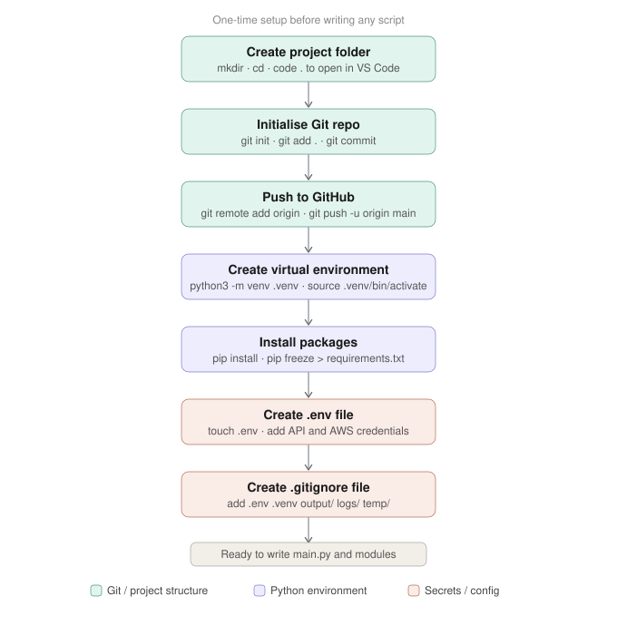
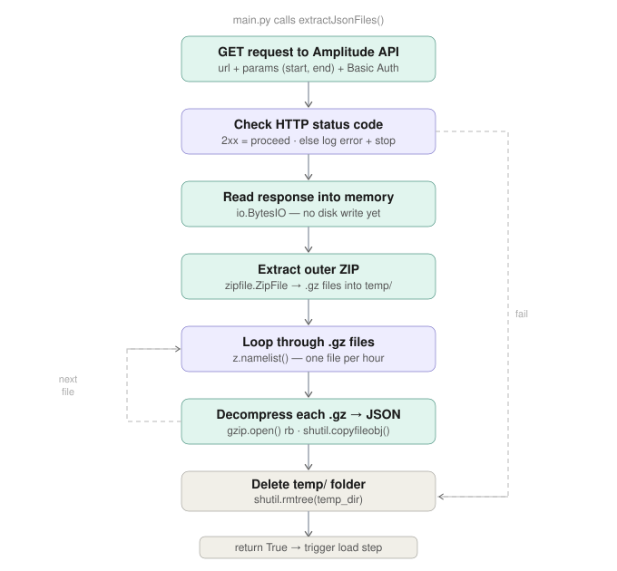
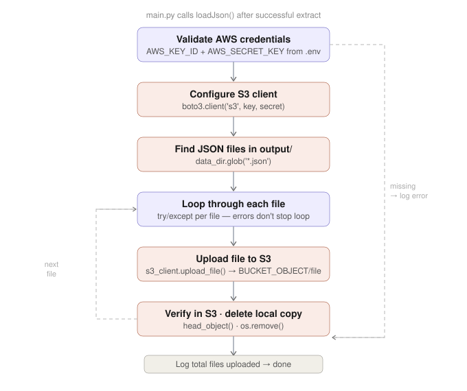

# Amplitude API Project

A Python pipeline that extracts raw event data from the [Amplitude Export API](https://amplitude.com/docs/apis/analytics/export) and loads the resulting JSON files into an AWS S3 bucket.

---

## How it works

The Amplitude Export API returns a `.zip` archive containing multiple `.gz` compressed files — one per hour in the requested time window. This pipeline:

1. Makes an authenticated GET request to the Amplitude Export API
2. Unpacks the outer `.zip` into a temporary directory
3. Decompresses each `.gz` file into JSON
4. Uploads the JSON files to a configured S3 bucket
5. Cleans up all local files after a successful upload

---

## Pipeline diagrams

### Project setup



### Extract



### Load



---

## Project structure

```
amplitude-api-project/
├── main.py                           # Orchestrator — runs the full pipeline
├── modules/
│   ├── setup_logging.py              # Configures timestamped logging
│   ├── unzip_and_extract_json.py     # API call, unzip, extract JSON
│   └── upload_json_to_s3.py          # Uploads JSON files to S3
├── aws/
│   └── templates/
│       ├── iam-policy-python.json    # IAM policy template for this script
│       ├── kms-policy.json           # KMS key policy template
│       └── s3-bucket-encryption.json # S3 bucket encryption config
├── docs/                             # Pipeline diagrams
├── Archive/                          # Original single-file scripts (reference only)
├── .env                              # Credentials — not committed to Git
├── .gitignore
└── requirements.txt
```

---

## Prerequisites

- Python 3.x
- An Amplitude account with Export API access (API key and secret key)
- An AWS account with an S3 bucket and IAM user configured (see [AWS setup](#aws-setup) below)

---

## Getting started

### 1. Clone the repo

```bash
git clone https://github.com/TIL-harrietowen/Amplitude-API-Project.git
cd Amplitude-API-Project
```

### 2. Create and activate a virtual environment

```bash
python3 -m venv .venv
source .venv/bin/activate
```

### 3. Install dependencies

```bash
pip install -r requirements.txt
```

### 4. Configure environment variables

Create a `.env` file in the root of the project:

```
AMP_API_KEY=your_amplitude_api_key
AMP_SECRET_KEY=your_amplitude_secret_key
AWS_KEY_ID=your_aws_access_key_id
AWS_SECRET_KEY=your_aws_secret_access_key
BUCKET=your_s3_bucket_name
BUCKET_OBJECT=your_s3_folder_path
```

> ⚠️ Never commit your `.env` file. It is included in `.gitignore`.

### 5. Set the time window

In `main.py`, update `start_time` and `end_time` to the hour range you want to extract. The expected format is `YYYYMMDDTHH`:

```python
start_time = '20260514T00'
end_time = '20260514T23'
```

> ⚠️ This is currently hardcoded. Dynamic date handling (pulling yesterday's data automatically) is a planned improvement.

### 6. Run the script

```bash
python3 main.py
```

Logs are written to the `logs/` directory, with one timestamped file per run. Expected terminal output on success:

```
Connection was successful, status code: 200
<filename> uploaded to the S3 bucket: <bucket-name>
Scripts ran successfully
```

---

## AWS setup

Before running the script, the following AWS resources need to be in place.

### S3 bucket

Create an S3 bucket to store the extracted JSON files. Note the bucket name — this goes into your `.env` as `BUCKET`.

### KMS encryption key

Create a symmetric KMS key and attach the policy from `aws/templates/kms-policy.json`. Note the Key ID — it is referenced in the IAM policy.

### IAM user and policy

Create an IAM user and attach a custom policy using the template at `aws/templates/iam-policy-python.json`. Replace the following placeholders before applying:

- `<your-name>` — your S3 bucket name prefix
- `<account-id>` — your AWS account ID
- `<KeyId>` — your KMS key ID

This policy grants the minimum permissions needed: `PutObject`, `GetObject`, `DeleteObject`, and the KMS permissions required to encrypt and decrypt objects in the bucket.

### Access key

Generate an access key for the IAM user (use case: **Local code**) and add the credentials to your `.env` file as `AWS_KEY_ID` and `AWS_SECRET_KEY`.

> ⚠️ The secret access key is only shown once at creation time — copy it immediately.

---

## Known issues

- There is a redundant `requests.get()` call on line 42 of `main.py`. The response is never used as `extractJsonFiles()` makes its own internal API call. To be removed in a future update.

---

## Planned improvements

- Dynamic `start_time` / `end_time` to automatically pull yesterday's data
- Remove redundant API call on line 42 of `main.py`

---

## Dependencies

See `requirements.txt` for pinned versions. Key packages:

| Package | Purpose |
|---|---|
| `requests` | HTTP requests to the Amplitude API |
| `python-dotenv` | Loads credentials from `.env` |
| `boto3` | AWS SDK — uploads files to S3 |
